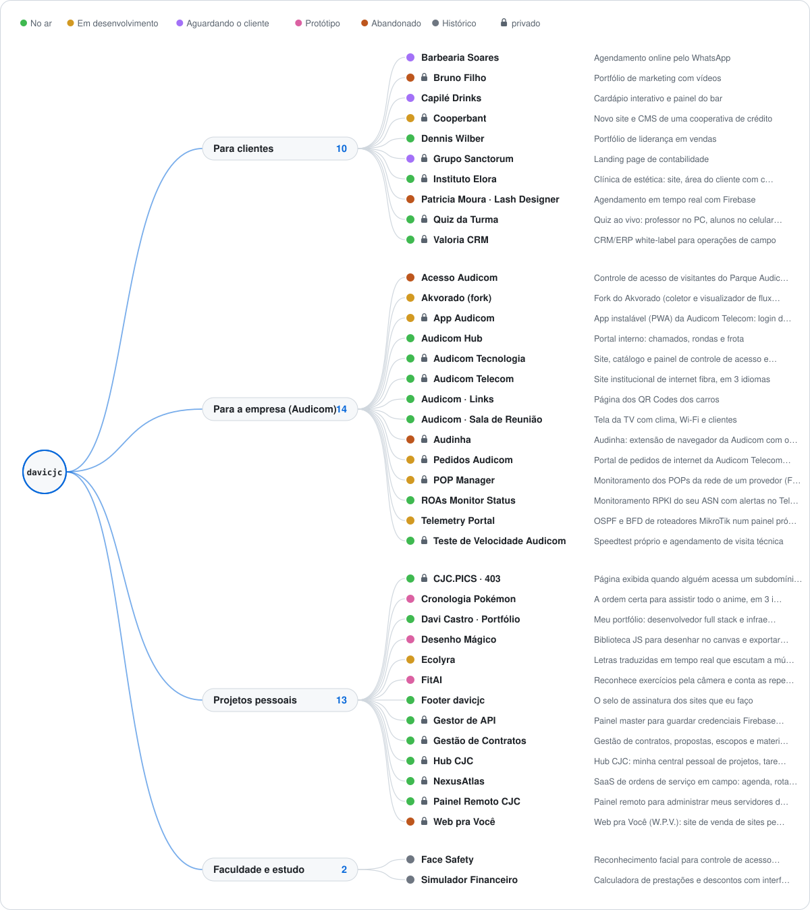

<!-- Gerado por perfil/gerar.py a partir de perfil/projetos.json — edite o JSON, não este arquivo. -->

  <picture>
    <source media="(prefers-color-scheme: dark)" srcset="perfil/svg/arvore-escuro.svg">
    
  </picture>

# 🌳 Árvore de projetos

Todos os meus projetos num só lugar: **para quem foi feito**, **para que serve** e **em que pé está**. Os privados (🔒) aparecem com nome e propósito, mas o código continua fechado.

*Atualizado em 07/10/2026 · 39 projetos · 20 privados · 19 públicos*

## Legenda

| Situação | Significa |
|---|---|
| ✅ **No ar** | entregue e funcionando, em uso |
| 🔄 **Recebe atualizações** | entregue e ainda recebe melhorias |
| 📦 **Entregue** | entregue, sem atualizações previstas |
| 🛠️ **Em desenvolvimento** | sendo construído agora |
| 👀 **Aguardando o cliente** | pronto ou quase, esperando o cliente ver/aprovar |
| ❌ **Proposta recusada** | feito como proposta e não aprovado |
| 🧪 **Protótipo** | teste ou prova de conceito |
| ⏸️ **Pausado** | parado por enquanto |
| 🛑 **Abandonado** | não vai continuar |
| 🗄️ **Histórico** | antigo, mantido só como registro |
| ❔ **A confirmar** | ainda não classificado |

## Índice

- [Para clientes](#para-clientes) — 10
- [Para a empresa (Audicom)](#para-a-empresa-audicom) — 14
- [Projetos pessoais](#projetos-pessoais) — 13
- [Faculdade e estudo](#faculdade-e-estudo) — 2

## Para clientes

| | Projeto | Para que serve | Situação | Ano | Links |
|---|---|---|---|---|---|
| 🌐 | **Barbearia Soares** | Agendamento online pelo WhatsApp HTML5 · CSS3 · JavaScript | 👀 Aguardando o cliente | 2026 | [site](https://davicjc.github.io/BarbeariaSoares/) · [código](https://github.com/Davicjc/BarbeariaSoares) |
| 🔒 | **Bruno Filho** | Portfólio de marketing com vídeos HTML5 · CSS3 · JavaScript | 🛑 Abandonado | 2026 | [site](https://davicjc.github.io/BrunoFilhoPortifolio/) |
| 🌐 | **Capilé Drinks** | Cardápio interativo e painel do bar HTML5 · CSS3 · JavaScript | 👀 Aguardando o cliente | 2026 | [site](https://davicjc.github.io/CapileSite/) · [código](https://github.com/Davicjc/CapileSite) |
| 🔒 | **Cooperbant** | Novo site e CMS de uma cooperativa de crédito HTML5 · CSS3 · JavaScript · Firebase | 🛠️ Em desenvolvimento | 2026 | — |
| 🌐 | **Dennis Wilber** | Portfólio de liderança em vendas HTML5 · CSS3 · JavaScript | ✅ No ar | 2025 | [site](https://davicjc.github.io/PortifolioDDWilber/) · [código](https://github.com/Davicjc/PortifolioDDWilber) |
| 🔒 | **Grupo Sanctorum** | Landing page de contabilidade HTML5 · CSS3 · JavaScript | 👀 Aguardando o cliente | 2026 | [site](https://davicjc.github.io/Pagina_Sanctorum/) |
| 🔒 | **Instituto Elora** | Clínica de estética: site, área do cliente com chat e painel HTML5 · CSS3 · JavaScript · Firebase | ✅ No ar | 2026 | [site](https://davicjc.github.io/InstitutoElora/) |
| 🌐 | **Patricia Moura · Lash Designer** | Agendamento em tempo real com Firebase HTML5 · CSS3 · JavaScript · Firebase | 🛑 Abandonado | 2026 | [site](https://davicjc.github.io/PatriciaMouraLashDesign/) · [código](https://github.com/Davicjc/PatriciaMouraLashDesign) |
| 🔒 | **Quiz da Turma** Rodrigo (professor) | Quiz ao vivo: professor no PC, alunos no celular com PIN HTML5 · JavaScript · Firebase | ✅ No ar | 2026 | — |
| 🔒 | **Valoria CRM** Alpa Solutions | CRM/ERP white-label para operações de campo HTML5 · Tailwind CSS · JavaScript · Firebase | ✅ No ar | 2026 | [site](https://davicjc.github.io/Crm_Alpa-Solutions/) |

## Para a empresa (Audicom)

| | Projeto | Para que serve | Situação | Ano | Links |
|---|---|---|---|---|---|
| 🌐 | **Acesso Audicom** Audicom Telecom | Controle de acesso de visitantes do Parque Audicom: cadastro web com QR Code, receptor Java e Raspberry Pi Pico liberando a catraca. HTML5 · CSS3 · JavaScript · Python | 🛑 Abandonado | 2025 | [site](https://davicjc.github.io/AcessoAudicom/) · [código](https://github.com/Davicjc/AcessoAudicom) |
| 🌐 | **Akvorado (fork)** Audicom Telecom | Fork do Akvorado (coletor e visualizador de fluxos de rede) adaptado para a rede da Audicom. | 🛠️ Em desenvolvimento | 2026 | [código](https://github.com/Davicjc/akvorado_cjc) |
| 🔒 | **App Audicom** Audicom Telecom | App instalável (PWA) da Audicom Telecom: login do cliente, central e teste de velocidade num só lugar. HTML5 · CSS3 · JavaScript · PWA | 🛠️ Em desenvolvimento | 2025 | [site](https://davicjc.github.io/AppAudicom/) |
| 🌐 | **Audicom Hub** Audicom Telecom | Portal interno: chamados, rondas e frota HTML5 · CSS3 · JavaScript · Firebase | ✅ No ar | 2026 | [site](https://davicjc.github.io/AudicomHub/) · [código](https://github.com/Davicjc/AudicomHub) |
| 🔒 | **Audicom Tecnologia** | Site, catálogo e painel de controle de acesso e ponto HTML5 · CSS3 · JavaScript · Firebase | ✅ No ar | 2025 | [site](https://davicjc.github.io/AudicomTecnologia/) |
| 🔒 | **Audicom Telecom** | Site institucional de internet fibra, em 3 idiomas HTML5 · CSS3 · JavaScript | ✅ No ar | 2025 | [site](https://audicomtelecom.com.br/) |
| 🌐 | **Audicom · Links** Audicom Telecom | Página dos QR Codes dos carros HTML5 · CSS3 · JavaScript | ✅ No ar | 2026 | [site](https://davicjc.github.io/QRCodeAudicomSite/) · [código](https://github.com/Davicjc/QRCodeAudicomSite) |
| 🌐 | **Audicom · Sala de Reunião** Audicom Telecom | Tela da TV com clima, Wi-Fi e clientes HTML5 · CSS3 · JavaScript | ✅ No ar | 2026 | [site](https://davicjc.github.io/AudicomSiteReuniao/) · [código](https://github.com/Davicjc/AudicomSiteReuniao) |
| 🔒 | **Audinha** Audicom | Audinha: extensão de navegador da Audicom com o chat de IA interno em qualquer página e exportação/classificação das conversas de atendimento do James. JavaScript · Chrome Extension | 🛑 Abandonado | 2026 | — |
| 🔒 | **Pedidos Audicom** Audicom Telecom | Portal de pedidos de internet da Audicom Telecom: o cliente pede, assina digitalmente e acompanha; a equipe gerencia em tempo real. HTML5 · JavaScript · Firebase | 🛠️ Em desenvolvimento | 2026 | [site](https://davicjc.github.io/PedidosAudicom/) |
| 🔒 | **POP Manager** Audicom Telecom | Monitoramento dos POPs da rede de um provedor (FastAPI) Python · FastAPI · PostgreSQL · SQLite | 🛠️ Em desenvolvimento | 2026 | — |
| 🌐 | **ROAs Monitor Status** Audicom | Monitoramento RPKI do seu ASN com alertas no Telegram Bash · Telegram | ✅ No ar | 2026 | [site](https://davicjc.github.io/ROAs-Monitor-Status/) · [código](https://github.com/Davicjc/ROAs-Monitor-Status) |
| 🌐 | **Telemetry Portal** Audicom | OSPF e BFD de roteadores MikroTik num painel próprio Python · Flask · MikroTik · Grafana | 🛠️ Em desenvolvimento | 2026 | [código](https://github.com/Davicjc/telemetry-portal) |
| 🔒 | **Teste de Velocidade Audicom** Audicom Telecom | Speedtest próprio e agendamento de visita técnica HTML5 · CSS3 · JavaScript · PHP | ✅ No ar | 2026 | [site](https://velocidadeteste.audicomtelecom.com.br/) |

## Projetos pessoais

| | Projeto | Para que serve | Situação | Ano | Links |
|---|---|---|---|---|---|
| 🔒 | **CJC.PICS · 403** | Página exibida quando alguém acessa um subdomínio inexistente da hospedagem cjc.pics — vídeo de fundo cinematográfico e aviso elegante. HTML5 · CSS3 | ✅ No ar | 2026 | — |
| 🌐 | **Cronologia Pokémon** | A ordem certa para assistir todo o anime, em 3 idiomas HTML5 · CSS3 · JavaScript | 🧪 Protótipo | 2026 | [site](https://davicjc.github.io/CronologiaPokemon/) · [código](https://github.com/Davicjc/CronologiaPokemon) |
| 🌐 | **Davi Castro · Portfólio** | Meu portfólio: desenvolvedor full stack e infraestrutura de redes em Uberlândia — projetos, certificados, currículo e contato. HTML5 · CSS3 · JavaScript | ✅ No ar | 2025 | [site](https://davicjc.com/) · [código](https://github.com/Davicjc/PortfolioPessoal) |
| 🌐 | **Desenho Mágico** | Biblioteca JS para desenhar no canvas e exportar em Base64 HTML5 · JavaScript | 🧪 Protótipo | 2026 | [site](https://davicjc.github.io/DesenhoBase64/) · [código](https://github.com/Davicjc/DesenhoBase64) |
| 🌐 | **Ecolyra** | Letras traduzidas em tempo real que escutam a música (Shazam + Whisper) Python · Tkinter | 🛠️ Em desenvolvimento | 2026 | [código](https://github.com/Davicjc/Ecolyra) |
| 🌐 | **FitAI** | Reconhece exercícios pela câmera e conta as repetições HTML5 · CSS3 · JavaScript · MediaPipe | 🧪 Protótipo | 2026 | [site](https://davicjc.github.io/FitIA/) · [código](https://github.com/Davicjc/FitIA) |
| 🌐 | **Footer davicjc** | O selo de assinatura dos sites que eu faço HTML5 · CSS3 · JavaScript · Cloudflare | ✅ No ar | 2026 | [site](https://footer.davicjc.com/) · [código](https://github.com/Davicjc/FooterDavicjc) |
| 🔒 | **Gestor de API** | Painel master para guardar credenciais Firebase de vários clientes e servi-las por uma API (Cloudflare Worker), sem expô-las no código. HTML5 · CSS3 · JavaScript · Firebase | ✅ No ar | 2026 | — |
| 🔒 | **Gestão de Contratos** | Gestão de contratos, propostas, escopos e material técnico dos clientes de TI, organizados por cliente, projeto e fase. Markdown · HTML5 · Python | ✅ No ar | 2026 | — |
| 🔒 | **Hub CJC** | Hub CJC: minha central pessoal de projetos, tarefas e notas de desenvolvimento — React, TypeScript, Vite e Firebase. React · TypeScript · Vite · Tailwind CSS | ✅ No ar | 2026 | — |
| 🔒 | **NexusAtlas** | SaaS de ordens de serviço em campo: agenda, rotas e mapa em tempo real HTML5 · JavaScript · Tailwind CSS · Firebase | ✅ No ar | 2026 | [site](https://nexusatlas.com.br/) |
| 🔒 | **Painel Remoto CJC** | Painel remoto para administrar meus servidores de jogo (Minecraft e Terraria) de fora da rede local, com login e fila de comandos no Firebase. HTML5 · JavaScript · Firebase | ✅ No ar | 2026 | — |
| 🔒 | **Web pra Você** | Web pra Você (W.P.V.): site de venda de sites personalizados, com serviços, planos, equipe e 6 sites de exemplo completos. HTML5 · CSS3 · JavaScript | 🛑 Abandonado | 2025 | — |

## Faculdade e estudo

| | Projeto | Para que serve | Situação | Ano | Links |
|---|---|---|---|---|---|
| 🌐 | **Face Safety** | Reconhecimento facial para controle de acesso — 🥇 1º lugar acadêmico Python · OpenCV | 🗄️ Histórico | 2023 | [código](https://github.com/Davicjc/FaceSafety) |
| 🌐 | **Simulador Financeiro** | Calculadora de prestações e descontos com interface gráfica em Python (Tkinter) — meu primeiro programa, feito para a faculdade. Python · Tkinter | 🗄️ Histórico | 2023 | [código](https://github.com/Davicjc/SimuladorFinanceiro) |

---

**Como atualizar:** edite [`perfil/projetos.json`](perfil/projetos.json) (campo `situacao`, `proposito`, `perfil` = `destaque` / `lista` / `ocultar`) e faça o commit — a Action regenera esta página, a árvore e o README.
