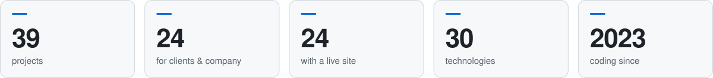

<!-- Gerado por perfil/gerar.py — edite perfil/README.en.md e perfil/projetos.json. -->

  
  

<picture>
  <source media="(prefers-color-scheme: dark)" srcset="perfil/svg/topo-en-escuro.svg">
  
</picture>

<b>I build systems and look after networks.</b> Websites, dashboards and automations for companies in Uberlândia — and the infrastructure of an internet provider running behind them.

  
    
    

<picture>
  <source media="(prefers-color-scheme: dark)" srcset="perfil/svg/numeros-en-escuro.svg">
  
</picture>

---

## 🗺️ Project map

Each branch is a kind of project; the bar shows where they stand.

<picture>
  <source media="(prefers-color-scheme: dark)" srcset="perfil/svg/mapa-en-escuro.svg">
  
</picture>

<a href="PROJETOS.md"><b>See the full tree — every project, what it is for and where it stands →</b></a>

---

## ⭐ Featured projects

### 🧪 My own projects

<table>
<tr>
<td width="50%" valign="top">
 
<a href="https://davicjc.github.io/CronologiaPokemon/"><b>Cronologia Pokémon</b></a> 
🧪 Prototype 
The right order to watch the whole anime, in 3 languages
</td>
<td width="50%" valign="top">
 
<a href="https://davicjc.github.io/DesenhoBase64/"><b>Desenho Mágico</b></a> 
🧪 Prototype 
JS library to draw on canvas and export as Base64
</td>
</tr>
<tr>
<td width="50%" valign="top">
 
<a href="https://github.com/Davicjc/Ecolyra"><b>Ecolyra</b></a> 
🛠️ In development 
Real-time translated lyrics that listen to the music (Shazam + Whisper)
</td>
<td width="50%" valign="top">
 
<a href="https://github.com/Davicjc/FaceSafety"><b>Face Safety</b></a> 
🗄️ Archive 
Facial recognition for access control — 🥇 1st academic place
</td>
</tr>
<tr>
<td width="50%" valign="top">
 
<a href="https://davicjc.github.io/FitIA/"><b>FitAI</b></a> 
🧪 Prototype 
Recognizes exercises through the webcam and counts reps
</td>
<td width="50%" valign="top">
 
<a href="https://footer.davicjc.com/"><b>Footer davicjc</b></a> 
✅ Live 
The signature badge on the websites I build
</td>
</tr>
<tr>
<td width="50%" valign="top">
 
<a href="https://nexusatlas.com.br/"><b>NexusAtlas</b></a> 
✅ Live · <code>🔒 Private</code> 
Field-service SaaS: schedule, routes and real-time map
</td>
<td width="50%"></td>
</tr>
</table>

### 🤝 Built for clients & company

<table>
<tr>
<td width="50%" valign="top">
 
<a href="https://davicjc.github.io/AudicomHub/"><b>Audicom Hub</b></a> 
✅ Live 
Internal portal: tickets, patrols and fleet
</td>
<td width="50%" valign="top">
 
<a href="https://davicjc.github.io/AudicomTecnologia/"><b>Audicom Tecnologia</b></a> 
✅ Live · <code>🔒 Private</code> 
Website, catalog and admin for access control
</td>
</tr>
<tr>
<td width="50%" valign="top">
 
<a href="https://audicomtelecom.com.br/"><b>Audicom Telecom</b></a> 
✅ Live · <code>🔒 Private</code> 
Fiber ISP corporate website, in 3 languages
</td>
<td width="50%" valign="top">
 
<a href="https://davicjc.github.io/QRCodeAudicomSite/"><b>Audicom · Links</b></a> 
✅ Live 
Landing page for the vehicle QR Codes
</td>
</tr>
<tr>
<td width="50%" valign="top">
 
<a href="https://davicjc.github.io/AudicomSiteReuniao/"><b>Audicom · Sala de Reunião</b></a> 
✅ Live 
Meeting-room TV screen
</td>
<td width="50%" valign="top">
 
<a href="https://davicjc.github.io/BarbeariaSoares/"><b>Barbearia Soares</b></a> 
👀 Awaiting client 
Online booking through WhatsApp
</td>
</tr>
<tr>
<td width="50%" valign="top">
 
<a href="https://davicjc.github.io/CapileSite/"><b>Capilé Drinks</b></a> 
👀 Awaiting client 
Interactive menu and bar dashboard
</td>
<td width="50%" valign="top">
 
<b>Cooperbant</b> 
🛠️ In development · <code>🔒 Private</code> 
New website and CMS for a credit union
</td>
</tr>
<tr>
<td width="50%" valign="top">
 
<a href="https://davicjc.github.io/PortifolioDDWilber/"><b>Dennis Wilber</b></a> 
✅ Live 
Sales leadership portfolio
</td>
<td width="50%" valign="top">
 
<a href="https://davicjc.github.io/Pagina_Sanctorum/"><b>Grupo Sanctorum</b></a> 
👀 Awaiting client · <code>🔒 Private</code> 
Accounting landing page
</td>
</tr>
<tr>
<td width="50%" valign="top">
 
<a href="https://davicjc.github.io/InstitutoElora/"><b>Instituto Elora</b></a> 
✅ Live · <code>🔒 Private</code> 
Aesthetics clinic: website, client area with chat and admin panel
</td>
<td width="50%" valign="top">
 
<b>POP Manager</b> 
🛠️ In development · <code>🔒 Private</code> 
Network POP monitoring for an ISP (FastAPI)
</td>
</tr>
<tr>
<td width="50%" valign="top">
 
<b>Quiz da Turma</b> 
✅ Live · <code>🔒 Private</code> 
Live classroom quiz: teacher on PC, students on phones
</td>
<td width="50%" valign="top">
 
<a href="https://davicjc.github.io/ROAs-Monitor-Status/"><b>ROAs Monitor Status</b></a> 
✅ Live 
RPKI monitoring for your ASN with Telegram alerts
</td>
</tr>
<tr>
<td width="50%" valign="top">
 
<a href="https://github.com/Davicjc/telemetry-portal"><b>Telemetry Portal</b></a> 
🛠️ In development 
OSPF and BFD from MikroTik routers in a custom dashboard
</td>
<td width="50%" valign="top">
 
<a href="https://velocidadeteste.audicomtelecom.com.br/"><b>Teste de Velocidade Audicom</b></a> 
✅ Live · <code>🔒 Private</code> 
Custom speed test and technician scheduling
</td>
</tr>
<tr>
<td width="50%" valign="top">
 
<a href="https://davicjc.github.io/Crm_Alpa-Solutions/"><b>Valoria CRM</b></a> 
✅ Live · <code>🔒 Private</code> 
White-label CRM/ERP for field operations
</td>
<td width="50%"></td>
</tr>
</table>

Also in production: [Web pra Você](https://webpravoce.shop/) · [Audicom Telecom](https://audicomtelecom.com.br/) · [Audicom Speed Test](https://velocidadeteste.audicomtelecom.com.br/) · [NexusAtlas](https://nexusatlas.com.br/)

> [!NOTE]
> **About the projects on this page**
>
> - Most of them were **built for real clients**, who are aware that the work appears in my portfolio.
> - Some have **not been launched** yet or are still in development, and a few are prototypes or proposals that were never adopted.
> - Third-party names, logos and trademarks **belong to their respective owners** and appear here only to show the work delivered — with no commercial use and no implied partnership or endorsement beyond the project itself.
> - Do you represent one of these brands and would rather it not appear here? Reach me at [contato@davicjc.com](mailto:contato@davicjc.com) and I'll remove it.

---

## 👨‍💻 About Me

I am a technology professional focused on **full-stack development**, software engineering, process automation, and **network infrastructure**. I have a strong analytical profile, technical leadership skills, and a great passion for technological innovation and problem solving.

- 🚀 Developed **over 20 corporate websites and web tools** focused on scalability and modern design.
- 🌎 Experience with **advanced bilingual technical support** (English) for global giant corporations like Verizon, BT, and China Telecom.
- 🏆 **1st Place** winner among 60 academic projects with the facial recognition system **Face Safety**.
- 🎓 Pursuing a Bachelor's degree in **Information Systems** (Uniube - Feb 2023 to Dec 2026).
- 📍 Based in Uberlândia, Minas Gerais, Brazil.

---

## 🛠️ My Technical Skills

### 💻 Languages and Frameworks

  
  
  
  
  
  
  
  

### 🗄️ Databases

  
  
  

### ⚙️ Infrastructure, DevOps & Tools

  
  
  
  
  
  
  

### 🤖 Artificial Intelligence & Others
> Machine Learning • Generative AI • LocalAI • Ollama • LM Studio • Open WebUI • OpenCV • Unity • Blender

---

## 💼 Featured Experience

- **Vice Supervisor, Developer & Network Technician** | *Audicom Telecom (Sep 2025 - Present)*  
  Development of systems (Python/C#) for biometric and facial control, SSO/SAML integration, server management (VMware ESXi), VPN tunnels, and monitoring via Grafana/Zabbix.
  
- **Founder & Developer** | *Web pra Você (2024 - Present)*  
  Own business focused on providing complete, accessible, and modern web design solutions for small and medium-sized enterprises.

- **Bilingual Corporate Relationship Manager** | *Algar Telecom (Dec 2023 - Jun 2025)*  
  Responsible for working in the Wholesale Team providing advanced technical support for critical infrastructures and managing major global telecom accounts.

---

## 📜 Main Certifications

I accumulate formal knowledge through extensive training, focusing heavily on **Microsoft Azure, AI, Data, and DevOps solutions**. Highlights:
- ☁️ **Microsoft Azure**: Database Administration, Workload Migration, AI Solutions, and Copilot Fundamentals.
- 🐍 **Development**: Python and IT English by Alura.
- 🛡️ **Security and Privacy**: Information Security and LGPD Certification.
- 🇺🇸 **Languages**: Advanced English (Certified by Wizard).

---

 

  
  

 

  

 

  
Made with passion for technology ☕ by Davi Castro Jorge da Costa.

Updated 2026-10-07 · this profile is generated by <a href="perfil/gerar.py"><code>perfil/gerar.py</code></a> from <a href="perfil/projetos.json"><code>projetos.json</code></a>

