<!-- Gerado por perfil/gerar.py — edite perfil/README.pt.md e perfil/projetos.json. -->

  
  

<picture>
  <source media="(prefers-color-scheme: dark)" srcset="perfil/svg/topo-escuro.svg">
  
</picture>

<b>Eu construo sistemas e cuido de redes.</b> Sites, painéis e automações para empresas de Uberlândia — e a infraestrutura de um provedor de internet funcionando por trás.

  
    
    

<picture>
  <source media="(prefers-color-scheme: dark)" srcset="perfil/svg/numeros-escuro.svg">
  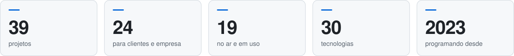
</picture>

---

## 🗺️ Mapa dos projetos

Cada galho é um tipo de projeto; a barra mostra em que pé eles estão.

<picture>
  <source media="(prefers-color-scheme: dark)" srcset="perfil/svg/mapa-escuro.svg">
  
</picture>

<a href="PROJETOS.md"><b>Ver a árvore completa — todos os projetos, para que servem e a situação de cada um →</b></a>

---

## ⭐ Projetos em destaque

### 🧪 Projetos próprios

<table>
<tr>
<td width="50%" valign="top">
 
<a href="https://davicjc.github.io/CronologiaPokemon/"><b>Cronologia Pokémon</b></a> 
A ordem certa para assistir todo o anime, em 3 idiomas
</td>
<td width="50%" valign="top">
 
<a href="https://davicjc.github.io/DesenhoBase64/"><b>Desenho Mágico</b></a> 
Biblioteca JS para desenhar no canvas e exportar em Base64
</td>
</tr>
<tr>
<td width="50%" valign="top">
 
<a href="https://github.com/Davicjc/Ecolyra"><b>Ecolyra</b></a> 
Letras traduzidas em tempo real que escutam a música (Shazam + Whisper)
</td>
<td width="50%" valign="top">
 
<a href="https://github.com/Davicjc/FaceSafety"><b>Face Safety</b></a> 
Reconhecimento facial para controle de acesso — 🥇 1º lugar acadêmico
</td>
</tr>
<tr>
<td width="50%" valign="top">
 
<a href="https://davicjc.github.io/FitIA/"><b>FitAI</b></a> 
Reconhece exercícios pela câmera e conta as repetições
</td>
<td width="50%" valign="top">
 
<a href="https://footer.davicjc.com/"><b>Footer davicjc</b></a> 
O selo de assinatura dos sites que eu faço
</td>
</tr>
<tr>
<td width="50%" valign="top">
<a href="https://nexusatlas.com.br/">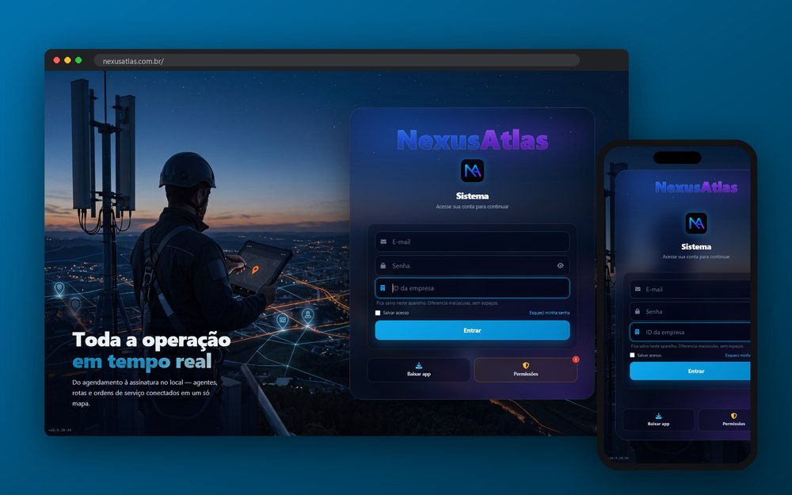</a> 
<a href="https://nexusatlas.com.br/"><b>NexusAtlas</b></a> 
<code>🔒 Privado</code> 
SaaS de ordens de serviço em campo: agenda, rotas e mapa em tempo real
</td>
<td width="50%"></td>
</tr>
</table>

### 🤝 Feitos para clientes e empresa

<table>
<tr>
<td width="50%" valign="top">
 
<a href="https://davicjc.github.io/AudicomHub/"><b>Audicom Hub</b></a> 
Portal interno: chamados, rondas e frota
</td>
<td width="50%" valign="top">
<a href="https://davicjc.github.io/AudicomTecnologia/">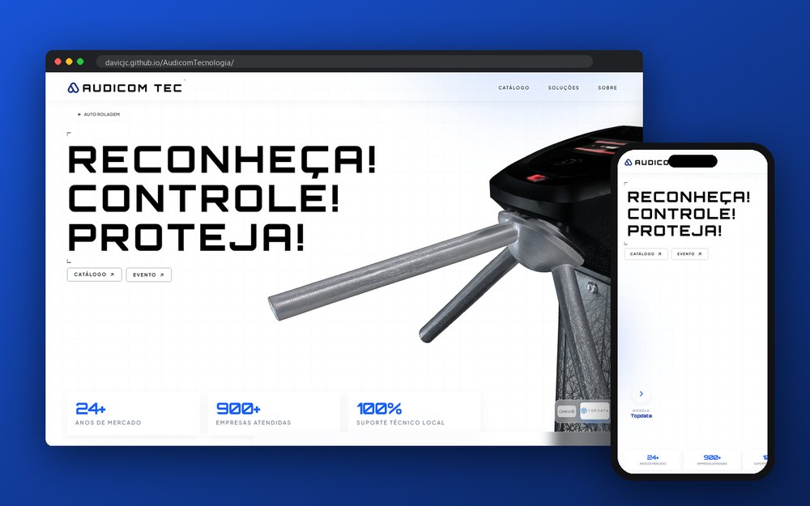</a> 
<a href="https://davicjc.github.io/AudicomTecnologia/"><b>Audicom Tecnologia</b></a> 
<code>🔒 Privado</code> 
Site, catálogo e painel de controle de acesso e ponto
</td>
</tr>
<tr>
<td width="50%" valign="top">
<a href="https://audicomtelecom.com.br/">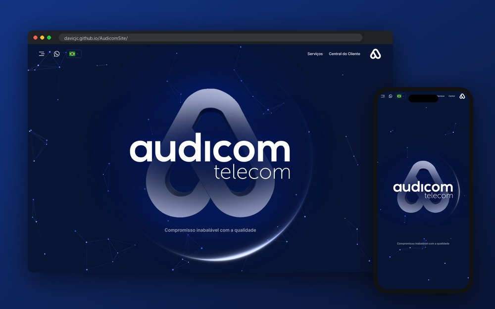</a> 
<a href="https://audicomtelecom.com.br/"><b>Audicom Telecom</b></a> 
<code>🔒 Privado</code> 
Site institucional de internet fibra, em 3 idiomas
</td>
<td width="50%" valign="top">
 
<a href="https://davicjc.github.io/QRCodeAudicomSite/"><b>Audicom · Links</b></a> 
Página dos QR Codes dos carros
</td>
</tr>
<tr>
<td width="50%" valign="top">
 
<a href="https://davicjc.github.io/AudicomSiteReuniao/"><b>Audicom · Sala de Reunião</b></a> 
Tela da TV com clima, Wi-Fi e clientes
</td>
<td width="50%" valign="top">
 
<a href="https://davicjc.github.io/BarbeariaSoares/"><b>Barbearia Soares</b></a> 
Agendamento online pelo WhatsApp
</td>
</tr>
<tr>
<td width="50%" valign="top">
<a href="https://davicjc.github.io/BrunoFilhoPortifolio/">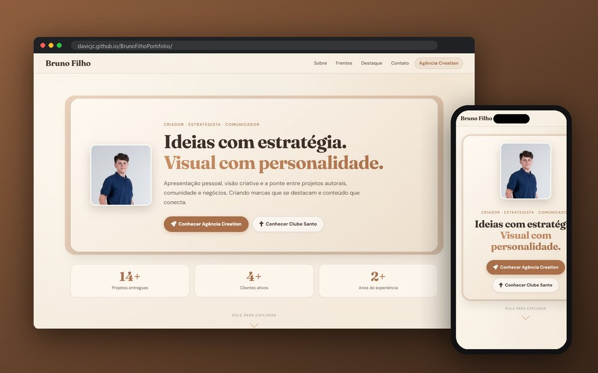</a> 
<a href="https://davicjc.github.io/BrunoFilhoPortifolio/"><b>Bruno Filho</b></a> 
<code>🔒 Privado</code> 
Portfólio de marketing com vídeos
</td>
<td width="50%" valign="top">
 
<a href="https://davicjc.github.io/CapileSite/"><b>Capilé Drinks</b></a> 
Cardápio interativo e painel do bar
</td>
</tr>
<tr>
<td width="50%" valign="top">
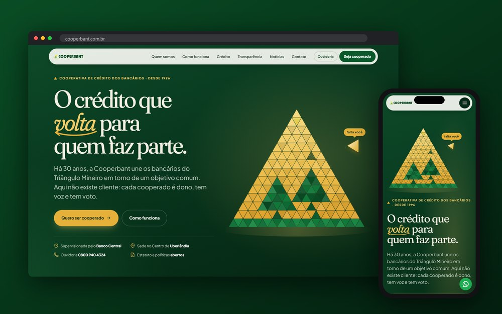 
<b>Cooperbant</b> 
<code>🔒 Privado</code> 
Novo site e CMS de uma cooperativa de crédito
</td>
<td width="50%" valign="top">
 
<a href="https://davicjc.github.io/PortifolioDDWilber/"><b>Dennis Wilber</b></a> 
Portfólio de liderança em vendas
</td>
</tr>
<tr>
<td width="50%" valign="top">
<a href="https://davicjc.github.io/Pagina_Sanctorum/">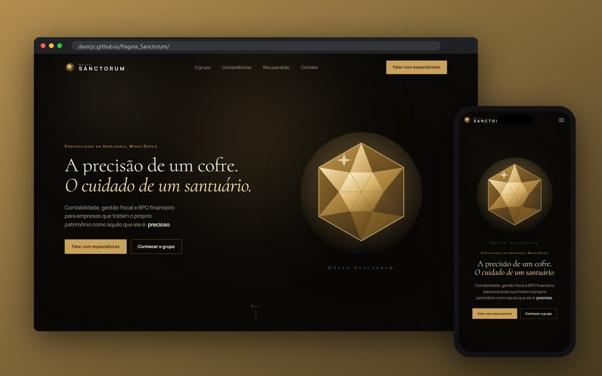</a> 
<a href="https://davicjc.github.io/Pagina_Sanctorum/"><b>Grupo Sanctorum</b></a> 
<code>🔒 Privado</code> 
Landing page de contabilidade
</td>
<td width="50%" valign="top">
<a href="https://davicjc.github.io/InstitutoElora/">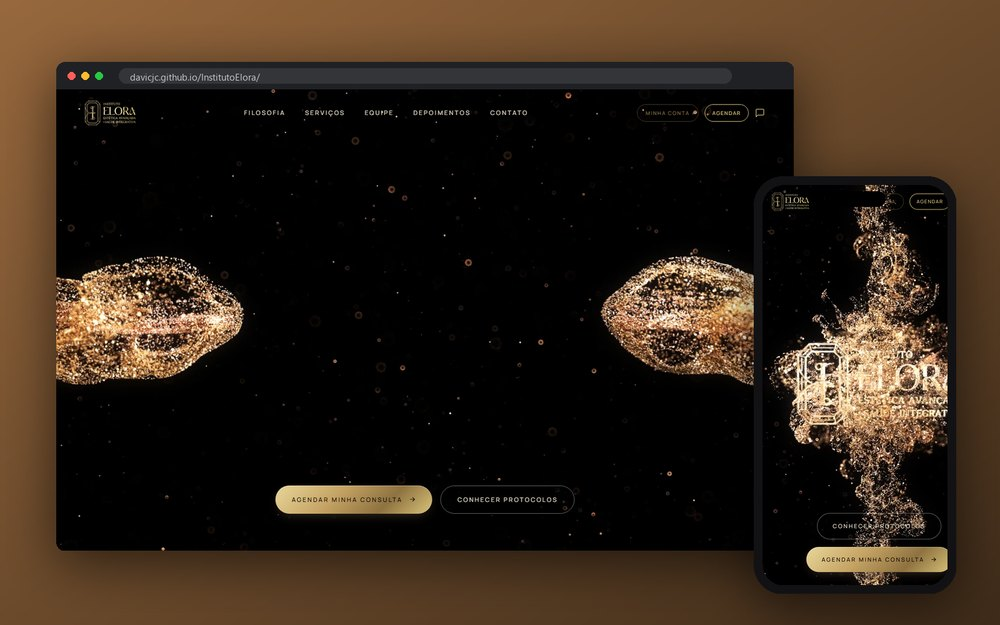</a> 
<a href="https://davicjc.github.io/InstitutoElora/"><b>Instituto Elora</b></a> 
<code>🔒 Privado</code> 
Clínica de estética: site, área do cliente com chat e painel
</td>
</tr>
<tr>
<td width="50%" valign="top">
 
<a href="https://davicjc.github.io/PatriciaMouraLashDesign/"><b>Patricia Moura · Lash Designer</b></a> 
Agendamento em tempo real com Firebase
</td>
<td width="50%" valign="top">
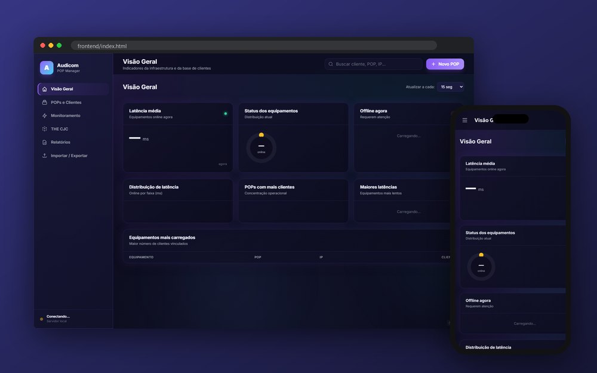 
<b>POP Manager</b> 
<code>🔒 Privado</code> 
Monitoramento dos POPs da rede de um provedor (FastAPI)
</td>
</tr>
<tr>
<td width="50%" valign="top">
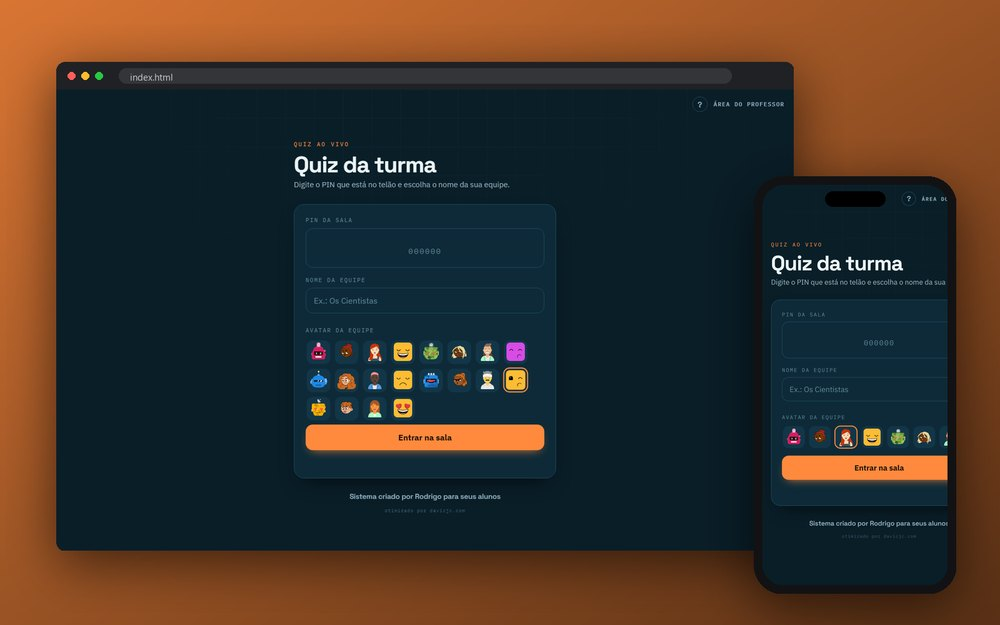 
<b>Quiz da Turma</b> 
<code>🔒 Privado</code> 
Quiz ao vivo: professor no PC, alunos no celular com PIN
</td>
<td width="50%" valign="top">
 
<a href="https://davicjc.github.io/ROAs-Monitor-Status/"><b>ROAs Monitor Status</b></a> 
Monitoramento RPKI do seu ASN com alertas no Telegram
</td>
</tr>
<tr>
<td width="50%" valign="top">
 
<a href="https://github.com/Davicjc/telemetry-portal"><b>Telemetry Portal</b></a> 
OSPF e BFD de roteadores MikroTik num painel próprio
</td>
<td width="50%" valign="top">
<a href="https://velocidadeteste.audicomtelecom.com.br/">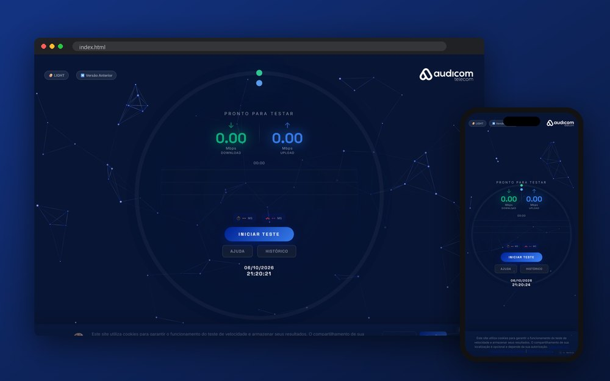</a> 
<a href="https://velocidadeteste.audicomtelecom.com.br/"><b>Teste de Velocidade Audicom</b></a> 
<code>🔒 Privado</code> 
Speedtest próprio e agendamento de visita técnica
</td>
</tr>
<tr>
<td width="50%" valign="top">
<a href="https://davicjc.github.io/Crm_Alpa-Solutions/">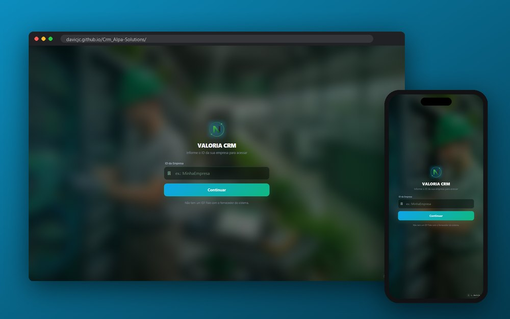</a> 
<a href="https://davicjc.github.io/Crm_Alpa-Solutions/"><b>Valoria CRM</b></a> 
<code>🔒 Privado</code> 
CRM/ERP white-label para operações de campo
</td>
<td width="50%"></td>
</tr>
</table>

Também em produção: [Web pra Você](https://webpravoce.shop/) · [Audicom Telecom](https://audicomtelecom.com.br/) · [Teste de Velocidade Audicom](https://velocidadeteste.audicomtelecom.com.br/) · [NexusAtlas](https://nexusatlas.com.br/)

> [!NOTE]
> **Sobre os projetos desta página**
>
> - A maior parte foi **desenvolvida para clientes reais**, que estão cientes de que o trabalho aparece no meu portfólio.
> - Alguns ainda **não foram lançados** ou estão em desenvolvimento, e há também protótipos e propostas que não chegaram a ser adotados.
> - Nomes, logos e marcas de terceiros **pertencem aos seus respectivos donos** e aparecem aqui apenas para mostrar o trabalho realizado — sem uso comercial e sem indicar parceria ou aprovação além do próprio projeto.
> - Representa alguma dessas marcas e prefere que ela não apareça aqui? Fale comigo em [contato@davicjc.com](mailto:contato@davicjc.com) que eu retiro.

---

## 👨‍💻 Sobre mim

Sou um profissional de tecnologia com foco em **desenvolvimento full-stack**, criação de softwares, automação de processos e **infraestrutura de redes**. Tenho forte perfil analítico, liderança técnica e uma grande paixão por inovação tecnológica e resolução de problemas.

- 🚀 Desenvolvi **mais de 20 sites e ferramentas web** corporativas focadas em escalabilidade e design moderno.
- 🌎 Experiência com **suporte técnico avançado bilíngue** (inglês) para corporações gigantes globais como Verizon, BT e China Telecom.
- 🏆 Vencedor do **1º Lugar** entre 60 projetos acadêmicos com o sistema de reconhecimento facial **Face Safety**.
- 🎓 Bacharelando em **Sistemas de Informação** (Uniube - Fev 2023 a Dez 2026).
- 📍 Residente em Uberlândia, Minas Gerais.

---

## 🛠️ Minhas Habilidades Técnicas

### 💻 Linguagens e Frameworks

  
  
  
  
  
  
  
  

### 🗄️ Bancos de Dados

  
  
  

### ⚙️ Infraestrutura, DevOps & Ferramentas

  
  
  
  
  
  
  

### 🤖 Inteligência Artificial & Outros
> Machine Learning • IA Generativa • LocalAI • Ollama • LM Studio • Open WebUI • OpenCV • Unity • Blender

---

## 💼 Experiência em Destaque

- **Vice Supervisor, Desenvolvedor & Técnico de Redes** | *Audicom Telecom (Set 2025 - Presente)*  
  Desenvolvimento de sistemas (Python/C#) para controle biométrico e facial, integração SSO/SAML, gestão de servidores (VMware ESXi), túneis VPN e monitoramento via Grafana/Zabbix.
  
- **Fundador & Desenvolvedor** | *Web pra Você (2024 - Presente)*  
  Negócio próprio focado em fornecer soluções completas, acessíveis e com design moderno na web para pequenas e médias empresas.

- **Gerente de Relacionamentos Empresariais Bilíngue** | *Algar Telecom (Dez 2023 - Jun 2025)*  
  Responsável por atuar no Time Atacado no suporte técnico de infraestruturas críticas e na gestão de grandes contas globais de telecomunicação.

---

## 📜 Principais Certificações

Acumulo conhecimento formal através de extensas capacitações, com maior foco em soluções **Microsoft Azure, IA, Dados e DevOps**. Destaques:
- ☁️ **Microsoft Azure**: Administração de Banco de Dados, Migração de Cargas de Trabalho, Soluções de IA e Fundamentos Copilot.
- 🐍 **Desenvolvimento**: Python e Inglês voltado para TI pela Alura.
- 🛡️ **Segurança e Privacidade**: Segurança da Informação e certificação LGPD.
- 🇺🇸 **Idiomas**: Inglês Avançado (Certificado pela Wizard).

---

 

  
  

 

  

 

  
Feito com paixão pela tecnologia ☕ por Davi Castro Jorge da Costa.

Atualizado em 07/10/2026 · este perfil é gerado por <a href="perfil/gerar.py"><code>perfil/gerar.py</code></a> a partir de <a href="perfil/projetos.json"><code>projetos.json</code></a>

